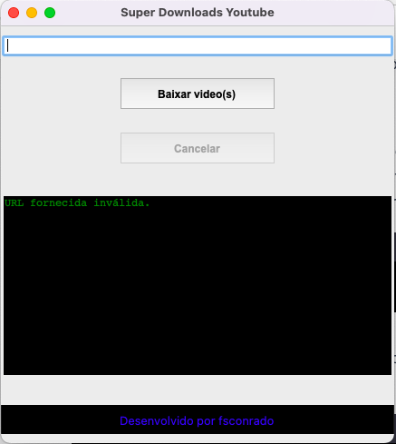

# Super Downloads YouTube

Uma ferramenta simples criada por Fabiano para baixar vídeos ou playlists completas do YouTube. 


<div style="display: flex; justify-content: center;">
  
</div>


## Características

- Interface amigável com uma janela de terminal para monitorar o progresso do download.
- Suporta o download de vídeos individuais ou playlists completas.
- O usuário pode cancelar downloads em andamento.
- Os vídeos baixados são salvos na pasta `music` no diretório atual do script.
- Ao final dos downloads, o usuário tem a opção de encerrar o programa e ir diretamente para os vídeos baixados ou continuar usando a aplicação.

## Pré-requisitos

Certifique-se de ter todas as bibliotecas necessárias instaladas. Você pode fazer isso com o seguinte comando:

```bash
pip install -r requirements.txt
